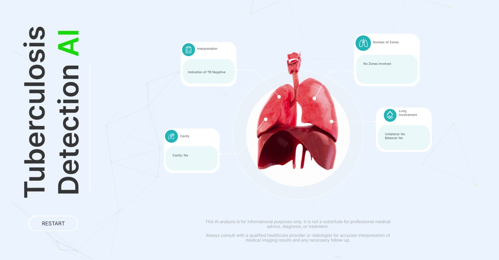

# Tuberculosis Detection AI Project

## Overview

This project aims to develop an AI-based system for the detection of Tuberculosis (TB) in chest X-ray images. Tuberculosis is a contagious bacterial infection that primarily affects the lungs and can be life-threatening if not diagnosed and treated early. The goal of this project is to assist healthcare professionals in the early detection of TB through automated image analysis.

## Features

- Automated classification of chest X-ray images into TB-positive or TB-negative categories.
- User-friendly web application for uploading and analyzing X-ray images.
- Continuous Integration/Continuous Deployment (CI/CD) pipeline for efficient development and deployment.
- Monitoring and alerting to ensure system health and performance.

## Technologies Used

- Python
- TensorFlow for AI model development
- Flask for the web application
- Docker for containerization
- Jenkins for CI/CD automation
- Prometheus and Grafana for monitoring

## Getting Started

### Prerequisites

- Python (3.x)
- Docker
- Git
- Jenkins (if setting up CI/CD)
- Prometheus and Grafana (if setting up monitoring)

### Installation

1. Clone this repository to your local machine:

   ```shell
   git clone <repository-url>
   cd TuberculosisAI
   ```

2. Develop a simplified TB detection AI model using Python and TensorFlow/Keras:

   ```shell
   python3 tb_detection_model.py
   ```

3. Build and run the Docker container:

   ```shell
   docker build -t <docker-image-name> .
   docker run -d -p 5000:5000 <docker-container-name:tag name>
   ```

4. Access the web application at http://localhost:5000

## Screenshots




## Usage

1. Upload a chest X-ray image through the web application.
2. Wait for the AI model to process the image.
3. View the classification result (TB-positive or TB-negative) on the web interface.

## Contributing

Contributions are welcome! If you would like to contribute to this project, please open an issue or submit a pull request.

## License

This project is licensed under the [MIT License](LICENSE).

## Author

- Ravi Rajvanshi (AI Enthusiast, DevOps Engineer, Web Developer)

## Contributors

- Dr. Rajiv Garg (Professor at KGMU, Lucknow)
- Akshaya Singh (DevOps Engineer)

## Contact

For questions or inquiries, please contact at its.ravi@outlook.com.
```

I've added the author and contributors' information to the README.md. Make sure to replace `<repository-url>` with your actual repository URL and adjust any other details as needed. Your README is now well-documented with the necessary project information.
